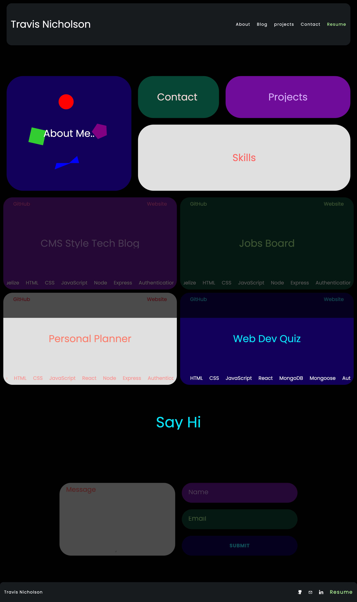

# Project Title
Portfolio
## Description
Write a description of the project.

- The portfolio website showcases my current skills and projects i have build using various languages, frameworks and libraries.
- The portfolio website is a single page application that is responsive to different screen sizes.
- The portfolio website is built using React and is connected to an API to deployed on render which controls the contact form.
## Table of contents
- [Installation](#installation)
- [Usage](#Usage)
- [Contributing](#Contributing)
- [Tests](#Tests)
- [Questions](#Questions)
- [license](#license)

## Installation
- To install the project follow the following steps:
- Clone the repository from GitHub
- Run npm install to install the dependencies
- Run npm start to start the application
- The application will open in your default browser
## Usage

### Screenshot

## Built with
### Programming Languages
- HTML
- CSS
- JavaScript
### Frameworks

### Libraries / Packages
- React
- Tailwind CSS
## Contributing
- Travis Nicholson
## Tests
- N/A
## Questions
### links
- [GitHub Username](https://github.com/Travisnicholson90)
- [GitHub Repository](https://github.com/Travisnicholson90/portfolio-usyd)
- [Deployed Application](https://travisnicholson90.github.io/portfolio-usyd/)

### Email
- For any further question relating to this project, please contact me via email.
[Travis Nicholson](mailto::nicholson_travis@hotmail.com)

## License
[]
 - (https://opensource.org/licenses/MIT)

